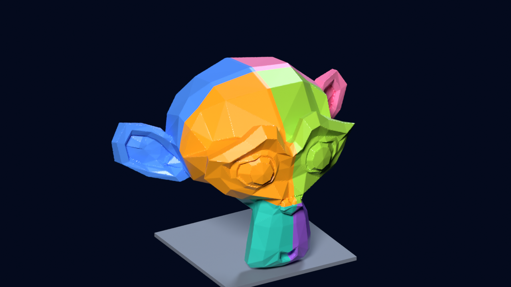

# Bed Fit Splitter

A Blender add-on that splits a model too big for your 3D printer into parts that fit the bed. You enter the bed size; it plans the cuts, cuts matching **alignment-dowel sockets** in both halves of every joint, and exports **print-ready STL files**.

**Get it:** https://croucamp.gumroad.com/l/bed-fit-splitter ($19, 30-day refund, includes a guide and a 400 mm sample model)

## What it does
- Pick a bed preset (180 to 420 mm) or type your own; it uses the fewest equal-sized parts and can turn the model on its side if that needs fewer.
- Cuts matching dowel sockets in both halves of every joint, and makes the loose dowels to print (defaults: 6 mm dowel, 8 mm sockets, 0.2 mm clearance, all adjustable).
- Exports one STL per part already turned to its best print orientation, a plate of dowels, and `print_plan.txt` listing every part size, volume and joint.
- Checks itself: total volume must equal the original minus the sockets, exported parts are checked against your bed, joints too thin for a dowel are reported.
- Non-destructive: the original is hidden, not deleted.

## Measured results
- A solid 400 mm test model on a 220 x 220 x 250 mm bed: **8 parts, 36 dowels**, every part fits, no warnings.
- A 1.3 million triangle mesh: 8 parts with dowels in about **15 seconds** on a 2-core CPU.
- 46 automated tests plus a full buyer-path test of the download on **Blender 4.2.9 LTS and 5.1.2**.

## Honest limits
- Cuts are straight and grid-aligned and chosen automatically. No hand-placed, curved or angled cuts, so it is not for "split it exactly at the neck".
- The mesh must be watertight; it refuses and tells you what is wrong rather than repairing.
- Round dowels only. Orientation picks the largest flat face down; supports are left to your slicer.
- Tested on Linux. Windows and macOS have not been tested (hence the 30-day refund).
- Blender 4.2 LTS or newer. GPL-3.0-or-later.

## Free alternatives
If you only need a few cuts, Blender's Bisect tool or a Boolean modifier works, and slicers have cut tools. This add-on is for when you would rather not place every cut and connector by hand.

Developer: Hanru Croucamp
